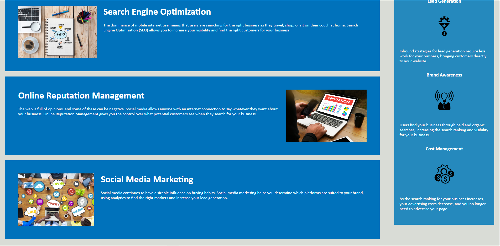

# homework1

## Project Name: Bootcamp homework 1 - Horiseon Marketing Website

## Description:
This project is improving and simplifying a website for Horiseon, a marketing company. The website will showcase the services and benefits Horiseon provides its customers. 

* Several changes were made to improve html semantics and simplify duplicate blocks of code in css. 
  
  * index.html changes
    * Changed div header class to header element to improve semantics
    * Changed div footer class to footer element for semantics
    * Deleted uneeded class tags next to id declarations in the content class for better readablity
    * Added alt tag to improve accessiblity
    * Changed classes inside benefits class into ids to better show their hierarchy
    
  * style.css changes
    * Updated css to call header element instead of class for semantic html
    * Updated css to call footer element instead of class for semantic html
    * Consolodated multiple header element calls with matching code into one
    * Consolodated multiple benefits element calls with matching code into one
    * Consolodated multiple content element calls with matching code into one
    

## Visual:

## Author: 
Jordan Stuckman
